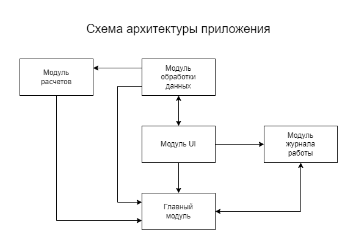

# Calculator

## Задача

Создать калькулятор для работы с рациональными и комплексными числами, организовать меню, добавив в неё систему логирования.

## Скриншоты

Скриншоты всех модулей находятся в папке *img*.

## Архитектура приложения

